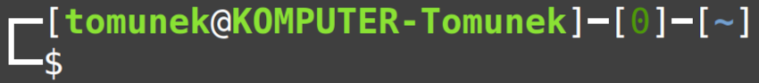

# Myconfig
My personal config files for linux. For now, it's only my `.bashrc`. I might add config files for other programs later.  
## Screenshots
Default:

With clock:

With git branch:


## Installation
To apply this config to your system, download this repo and run the installation script:
```console
git clone --depth 1 https://github.com/Tomunek/myconfig.git
cd myconfig
./install.sh
```
After installation, system default text editor will open, allowing you to modify config's options.